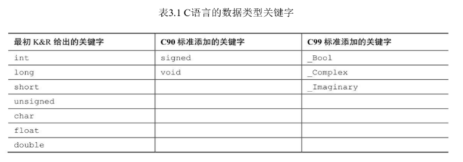
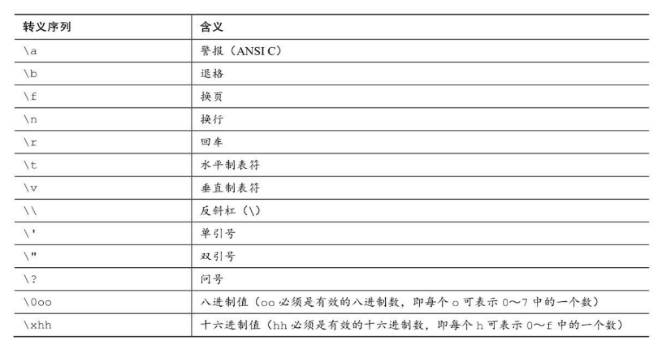
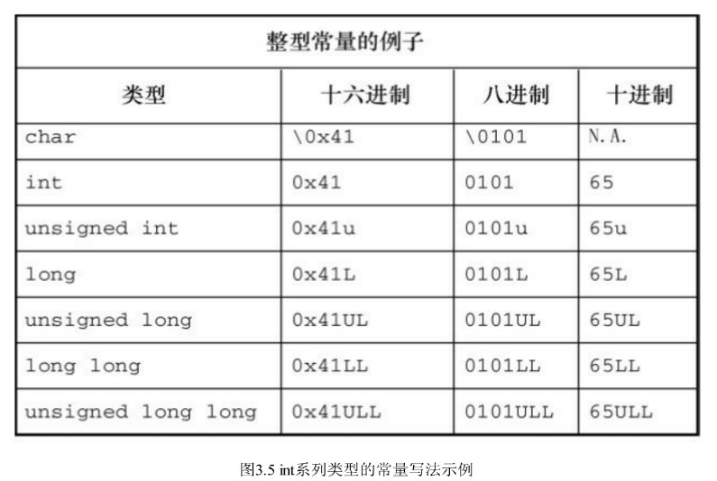

# 第3章 数据和C


## 3.3 数据：数据类型关键字



## 3.4.3 使用字符：char 类型

- C 语言将字符常量视为 int 类型而非 char 类型：

  ```c
  char grade = 'B';  		// 'B'对应的数值66储存在32位存储单元中
  char grade = 'FATE';	// 低8位 'E' 传给 grade
  ```

- 转义序列

  

- `\0oo` 和 `\xhh` 的使用

  ```c
  /* 以下4种写法均是警报字符 \a */
  beep = '\a';
  beep = 7;		// \a 的十进制ASCII码
  beep = '\007';	// 7的八进制
  beep = '\x07';  // 7的十六进制
  
  /* 八进制的延伸写法 */
  beep = '\07';
  beep = '\7';	// 没有前缀，编译器解释为八进制
  
  /* 十六进制的延伸写法 */
  beep = '\x007';
  beep = '\x7';	// \x 后跟1～3位十六进制数字均可
  beep = '\X7';	// \X 大写也可以
  ```

- int 系列类型的常量写法示例

  


## 3.4.5 可移植类型：stdint.h 和 inttypes.h

C99 新增了两个头文件 `stdint.h` 和 `inttypes.h`：

- `stdint.h` 提供精确宽度整数类型，如 `int32_t` 在不同系统中会被替换成与当前系统匹配的 32 位整数类型。
- `inttypes.h` 提供字符串宏来显示可移植类型，如 `PRId32` 代表打印 32 位有符号值的合适转换说明（如 `d` 或 `l`）。